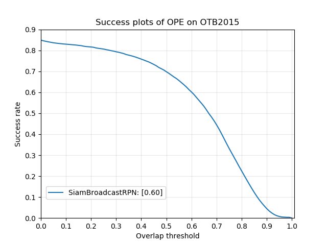
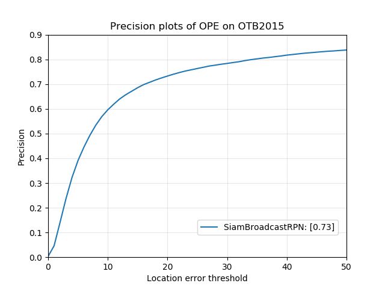
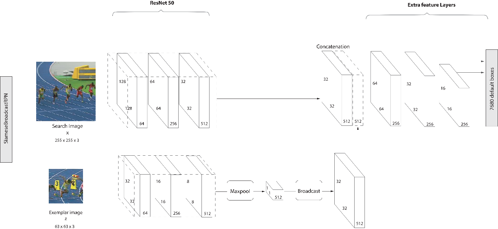

# SiamBroadcastRPN

Even if the state-of-the-art SiamRPN tracker achieves very competitve results, as shown in [Li et al., 2018], this alternative architecture achieves near state-of-the-art performance on common benchmark datasets like OBT-2015 using no correlation map.

Link to the full project report: [alexandre.carlier.page/projects/object_tracking](https://alexandre.carlier.page/projects/object_tracking/)

  
  

*Success and Precision plots of SiamBroadcastRPN on OTB-2015*  

*The SiamBroadcastRPN architecture. A MaxPool layer reduces the exemplar features to a vector, which can be concatenated to the search features after a Broadcast operation.*

Similarly to SSD, bounding boxes are regressed from different feature maps.

## Training
To start training the network, run the command `python3 train.py --config-file PATH/TO/CONFIG_FILE`.

## Config files
Configuration files are written in YAML (Yet Another Markup Language), which override the default configuration in `configs/defaults.py`.

# Benchmarking
To start benchmarking the model, run the command `python3 benchmark.py --checkpoint PATH/TO/CHECKPOINT --config-file PATH/TO/CONFIG/FILE`.
